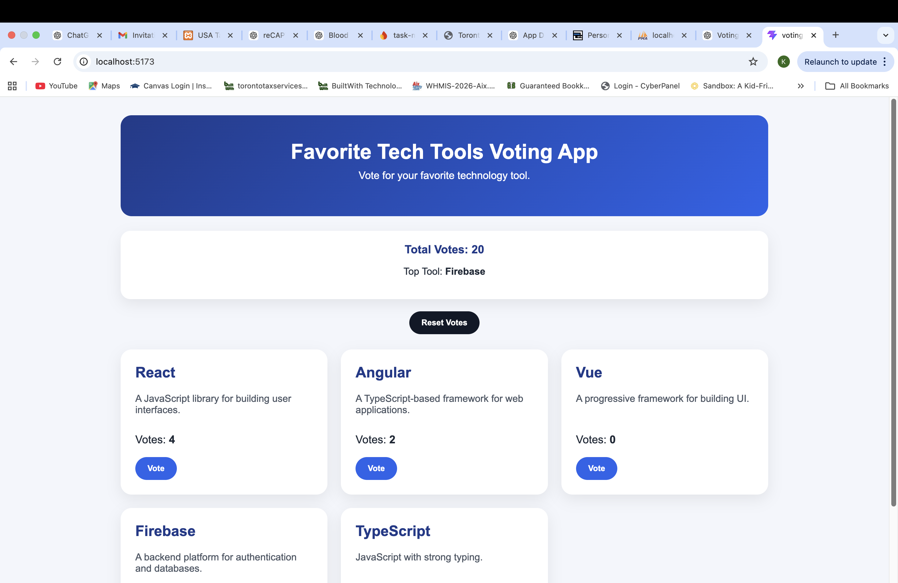
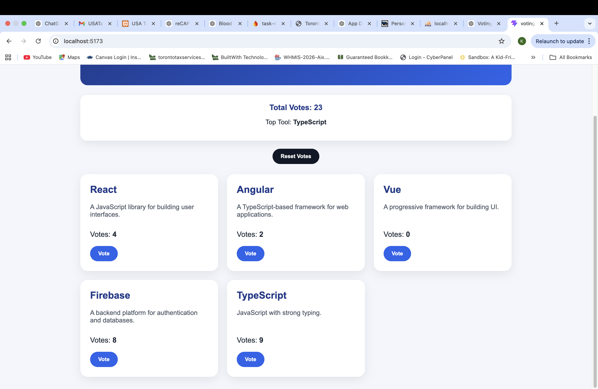
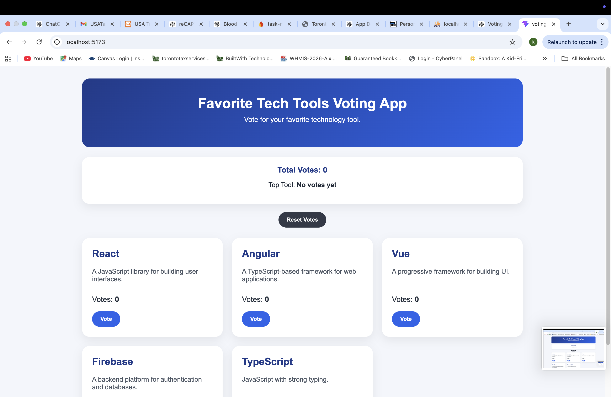
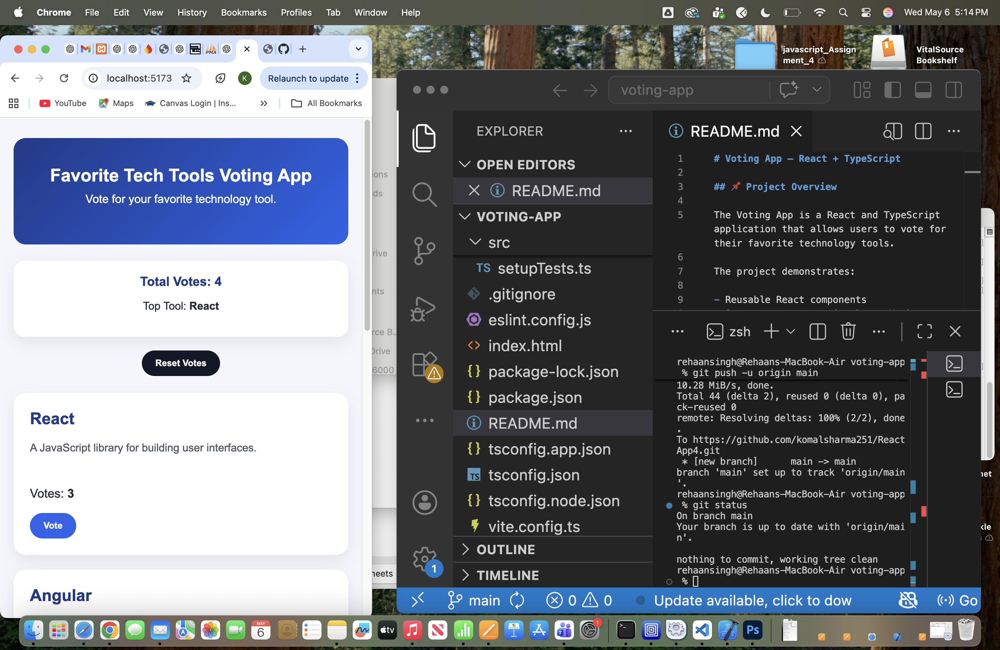
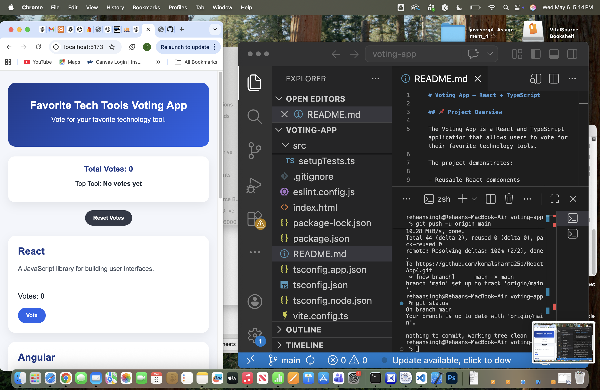
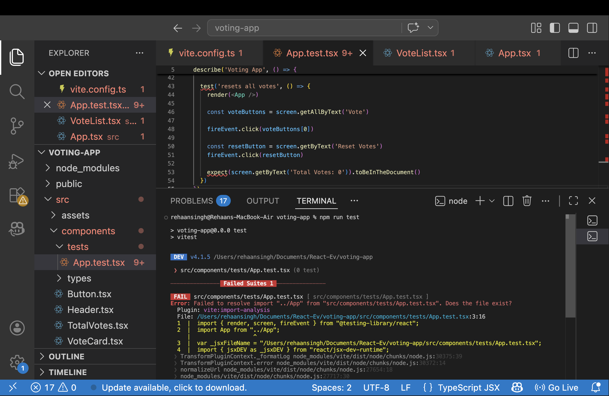
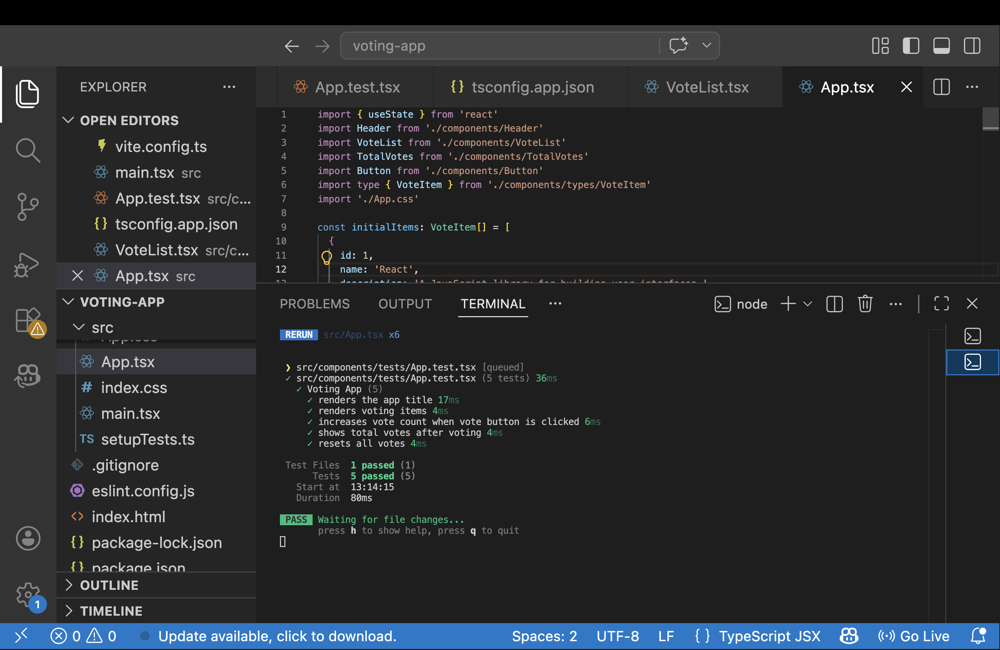

# Voting App – React + TypeScript

## 📌 Project Overview

The Voting App is a React and TypeScript application that allows users to vote for their favorite technology tools.

The project demonstrates:

- Reusable React components
- State management using React Hooks
- TypeScript interfaces
- Unit testing with Vitest and React Testing Library
- Responsive user interface design

---

# 🚀 Features

- ✅ Vote for technology tools
- ✅ Real-time vote updates
- ✅ Display total votes
- ✅ Display top voted tool
- ✅ Reset all votes
- ✅ Reusable components
- ✅ Responsive design
- ✅ Unit testing included

---

# 🛠 Technologies Used

- React
- TypeScript
- Vite
- CSS3
- Vitest
- React Testing Library

---

# 📂 Project Structure

```txt
src/
│
├── components/
│   ├── tests/
│   │   └── App.test.tsx
│   │
│   ├── types/
│   │   └── VoteItem.ts
│   │
│   ├── Button.tsx
│   ├── Header.tsx
│   ├── TotalVotes.tsx
│   ├── VoteCard.tsx
│   └── VoteList.tsx
│
├── App.tsx
├── App.css
├── index.css
├── main.tsx
├── setupTests.ts
```

---

# 🧩 Reusability

The application uses reusable React components to improve maintainability and code organization.

Reusable components include:

- `Button`
- `Header`
- `VoteCard`
- `VoteList`
- `TotalVotes`

The `VoteCard` component is dynamically reused for every technology tool.

---

# ⚙️ State Management

State management is implemented using the `useState` hook inside `App.tsx`.

The application stores voting data in a centralized state and passes data/functions to child components using props.

This demonstrates:

- Shared state management
- Parent-to-child communication
- Dynamic rendering
- React data flow

---

# 🧪 Unit Testing

The project includes unit testing using:

- Vitest
- React Testing Library

## Tests Included

- ✔ Application title renders correctly
- ✔ Voting items render correctly
- ✔ Vote button updates votes
- ✔ Total votes update correctly
- ✔ Reset functionality works

---

# 📱 Responsive Design

The application is fully responsive and works across:

- Desktop devices
- Tablets
- Mobile devices

Responsive layouts were created using CSS Grid and Media Queries.

---

# ▶️ How to Run the Project

## Install Dependencies

```bash
npm install
```

## Start Development Server

```bash
npm run dev
```

---

# 🧪 Run Unit Tests

```bash
npm run test
```

---

# 🏗 Build for Production

```bash
npm run build
```

This command generates an optimized production-ready build inside the `dist` folder.

---

# 📸 Application Features

- Technology voting cards
- Dynamic vote counting
- Total vote tracking
- Top voted technology display
- Reset vote functionality
- Responsive modern layout

---
# 📸 Screenshots

## Home Page







---

## Mobile Responsive View




---

## Unit Test Results




# 👨‍💻 Author

**Komal Sharma**

---

# 📚 Learning Outcomes

This project helped practice and understand:

- React Functional Components
- Component Reusability
- Props
- React Hooks (`useState`)
- TypeScript Interfaces
- Event Handling
- Conditional Rendering
- Unit Testing
- Responsive CSS Design
